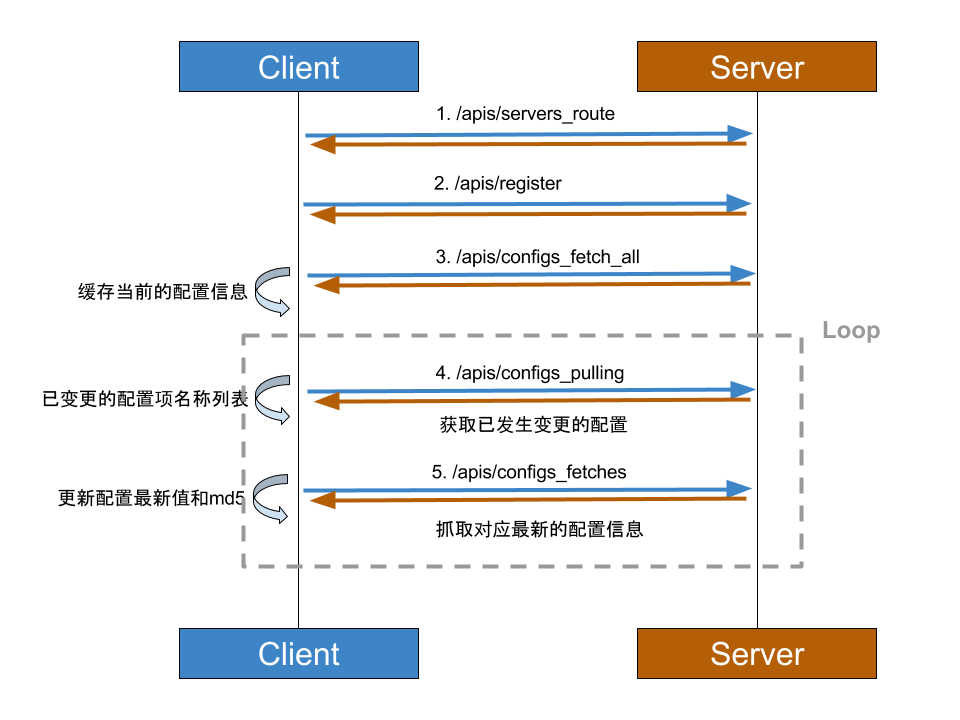

Diablo客户端API规范
---

### API基本规范

+ 所有响应无特殊说明，均以**JSON**格式返回。

### API基础接口

1. `/apis/servers_route`：
	
	+ 描述：为客户端路由一个可用的server；
	+ 请求方法：GET；
	+ 请求头：无；
	+ 请求参数：
		
		```
		{
			appName: 应用名称，
			pid：客户端进程id
		}
		```
		
	+ 响应参数：
		
		```
		{
			server: 路由的server地址：如192.168.1.111:2143，
			clientId：为客户端生成的id，后续请求需要放入Http头中
		}
		```

2. `/apis/register`：

	+ 描述：注册客户端到目标server；
	+ 请求方法：GET；
	+ 请求头：无；
	+ 请求参数：
		
		```
		{
			clientId: 请求1中返回的id，
			clientPid：客户端进程id
			appName：应用名称(创建应用时分配)，
			appKey：应用密钥(创建应用时分配)
		}
		```
		
	+ 响应参数(<font color="red">文本格式，非JSON格式</font>)：
		
		```
		true：注册成功
		false：注册失败
		```

3. `/apis/un_register`：

	+ 描述：客户端主动注销，通常在**客户端进程退出时**需要调用；
	+ 请求方法：GET；
	+ 请求头：
		
		```
		{
			clientId: 客户端id，
			appKey：应用密钥，若服务器配置了CLIENT_AUTH=true，客户端必须配置正确appKey
		}
		```
		
	+ 请求参数：无；
	+ 响应参数：无。

4. `/apis/configs_fetch`：

	+ 描述：获取单个配置项信息；
	+ 请求方法：GET；
	+ 请求头：
		
		```
		{
			clientId: 客户端id，
			appKey：应用密钥，若服务器配置了CLIENT_AUTH=true，客户端必须配置正确appKey
		}
		```
		
	+ 请求参数：
		
		```
		{
			name：配置项名称
		}
		```
		
	+ 响应参数：
		
		```
		{
			name：配置项名称，
			value：配置项的最新值，
			md5：配置项的最新md5值
		}
		```

5. `/apis/configs_fetches`：

	+ 描述：批量获取配置项信息；
	+ 请求方法：GET；
	+ 请求头：
		
		```
		{
			clientId: 客户端id，
			appKey：应用密钥，若服务器配置了CLIENT_AUTH=true，客户端必须配置正确appKey
		}
		```
		
	+ 请求参数：
		
		```
		{
			names：多个配置项名称，逗号相隔，如name1,name2,...
		}
		```
		
	+ 响应参数：
		
		```
		[{
			name：名称1，
			value：值1，
			md5：md5值1
		},{
			name：名称2，
			value：值2，
			md5：md5值2
		}, ...]
		```

5. `/apis/configs_fetch_all`：

	+ 描述：批量所有配置项信息；
	+ 请求方法：GET；
	+ 请求头：
		
		```
		{
			clientId: 客户端id，
			appKey：应用密钥，若服务器配置了CLIENT_AUTH=true，客户端必须配置正确appKey
		}
		```
	+ 请求参数：无；
	+ 响应参数：
		
		```
		[{
			name：名称1，
			value：值1，
			md5：md5值1
		},{
			name：名称2，
			value：值2，
			md5：md5值2
		}, ...]
		```

6. `/apis/configs_pulling`：

	+ 描述：拉取发生变更的配置项信息；
	+ 请求方法：GET；
	+ 请求头：
		
		```
		{
			clientId: 客户端id，
			appKey：应用密钥，若服务器配置了CLIENT_AUTH=true，客户端必须配置正确appKey，
			Pulling-Timeout：长轮询超时时间，建议为30s即可
		}
		```
		
	+ 请求参数(配置项map信息：key为配置项名称，value为配置项md5值)：
		
		```
		{
			"name1": "md5_1", 
			"name2", "md5_2", 
			...
		}
		```
		
	+ 响应参数(返回已发生变更的配置项名称列表)：
		
		```
		["config_name1","config_name2"]
		```


### 注意事项

+ 除了接口1和2，其他接口均需要在请求中加入必要的请求头。
+ 客户端接口应满足一些基本要求：
	+ **高可用性**：当某些server不可用时，应该继续尝试获取其他可用的server；
	+ **容错性**：当所有server均不可用时，不应影响当前应用的正常运行，此时仅不能获取最新的配置信息。

### 客户端与服务端交互流程图




### 可用的客户端实现

+ java。


