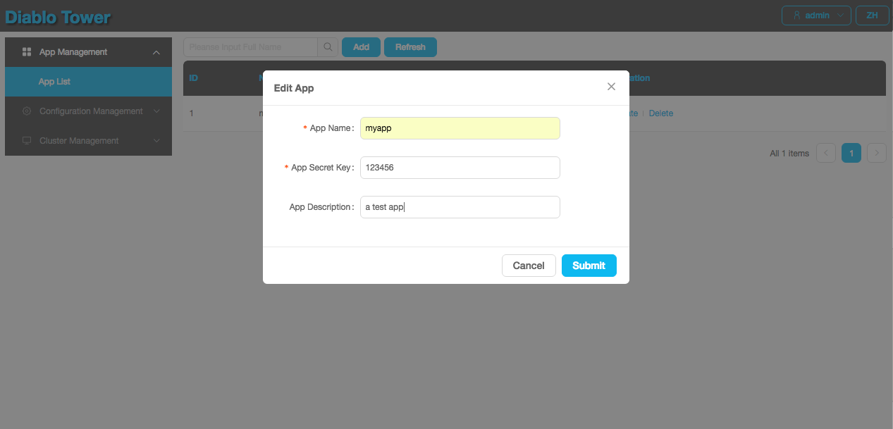
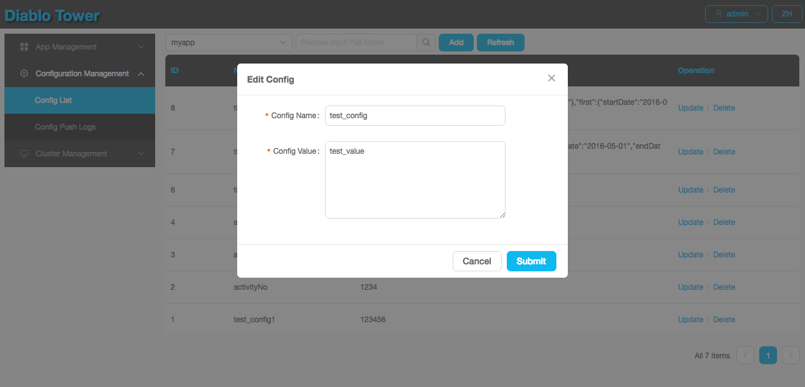

<center></center>

轻量的持久化配置服务
---

[English wiki](README_EN.md)。

<a href="http://diablo.hao0.me" target="_blank">在线Demo</a>。

## 一些特性

+ **轻量级**: 没有复杂的技术和第三方依赖;

+ **可靠存储**: 使用**Redis**作为存储，建议使用**Redis Cluster**，**Redis Master-Slave** 或者 **Redis Proxy Middleware**等技术保证存储的可靠性;

+ **对等的Server节点**: Server节点的对等性，保证即便某些Server不可用，集群仍能工作;

+ **近似实时更新**: diablo使用**Http长轮询**来保证客户端能及时得到配置更新的通知;

+ **简单的UI**: diablo内嵌了一个简单易用的web界面，叫做**Diablo Tower**;

+ ...


## Quick start

### 安装

+ [下载](https://github.com/ihaolin/diablo/releases)最新的压缩包；
+ 或者通过源码构建:

	```bash
	mvn clean package -DskipTests
	# package located diablo-server/target/diablo-server.tar.gz
	```

+ 解压缩包：

	```bash
	tar zxf diablo-server.tar.gz
	ll diablo
	bin		# the execute scripts
	conf	# conf dir
	lib		# dependency libs
	```	

+ 编辑配置文件**diablo.conf**：

	```bash
	# vim ${DIABLO_HOME}/conf/diablo.conf
	# The server bind address
	BIND_ADDR=127.0.0.1
	
	# The server listening port
	LISTEN_PORT=2143
	
	# The redis host
	REDIS_HOST=127.0.0.1
	
	# The redis port
	REDIS_PORT=6379
	
	# The log path
	LOG_PATH=~/logs/diablo
	
	# The password for Diablo Tower admin
	TOWER_PASS=admin
	
	# The inverval(seconds) for checking server's status
	CHECK_SERVER_INTERVAL=5
	
	# Enable or disable client api auth
	# client must config the appKey, if CLIENT_AUTH=true
	CLIENT_AUTH=true
	
	# Java Heap options
	JAVA_HEAP_OPTS="-Xms512m -Xmx512m"
	```

+ 启动或停止**diablo server**:

	```bash
	${DIABLO_HOME}/bin/diablo.sh start
	${DIABLO_HOME}/bin/diablo.sh stop
	${DIABLO_HOME}/bin/diablo.sh restart
	```

### 使用 Diablo Tower

+ 启动**diablo server**后，便可通过Http访问**diablo tower**(如[http://127.0.0.1:2143](http://127.0.0.1:2143));

+ 事先准备**应用**和**配置项**：
	
	+ 编辑应用: 
		
		
	
	+ 编辑配置项:

		

### 集成diablo client到应用中

+ [SimpleDiabloClient](diablo-client/src/main/java/me/hao0/diablo/client/SimpleDiabloClient)(**编程模式**):
	
	+ 添加maven依赖:

		```xml
		<dependency>
            <groupId>me.hao0</groupId>
            <artifactId>diablo-client</artifactId>
            <version>${version}</version>
    	</dependency>
		```
	
	+ 代码样例:

		```java
		SimpleDiabloClient client = new SimpleDiabloClient();
       client.setAppName("myapp");
       client.setAppKey("123456");
       client.setServers("127.0.0.1:2143,127.0.0.1:2144");
       client.start();
       
       // 获取配置项最新的值
       String testConfig = client.get("test_config");
       
       // 获取配置项最新的json对象
       MyClass myClass = client.get("test_json", MyClass.class);
       
       client.shutdown();
		```
	+ 具体见[测试用例](diablo-client/src/test/java/me/hao0/diablo/client/SimpleDiabloClientTests.java).

+ [SpringDiabloClient](diablo-client-spring/src/main/java/me/hao0/diablo/client/SpringDiabloClient)(**Spring注入模式**):

	+ 添加maven依赖:

		```xml
		<dependency>
            <groupId>me.hao0</groupId>
            <artifactId>diablo-client-spring</artifactId>
            <version>${version}</version>
    	</dependency>
		```
	
	+ 配置片段:

		```xml
		<bean class="me.hao0.diablo.client.SpringDiabloClient">
			<property name="appName" value="myapp" />
			<property name="appKey" value="123456" />
			<property name="servers" value="127.0.0.1:2143,127.0.0.1:2144" />
		</bean>
		```
	
	+ 添加**diablo配置Bean**到**spring上下文中**, 如:

		```java
		@Component
		public class MyAppConfig implements DiabloConfig {
		
			// 支持基本类型转换 
		    private String activityNo;
		    private Integer activityChannel;
		    private Boolean activityStart;
		    private Float activityRatio;
		    private Long activityCount;
		    private Double activityFee;
		 
		    // 支持普通json对象转换
		    private TimeInfo timeInfo;
		
		    // 支持一级List对象转换
		    private List<TimeInfo> timeInfos;
		
		    // 支持一级Map对象转换
		    private Map<String, TimeInfo> timeInfoMap;
			
			// getters and setters
		}
		```
		
	
	+ 具体见[测试用例](diablo-client-spring/src/test/java/me/hao0/diablo/client/SpringDiabloClientTests.java).

+ 这样一旦你通过**Diablo Tower**修改了对应配置项时，客户端将收到通知。

## 如何成为好人

+ 如果觉得还不错，就请喝咖啡吧：

	+ 支付宝:
		
		
	
	+ 微信:
	   
	       
	   
		 